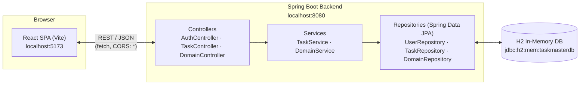
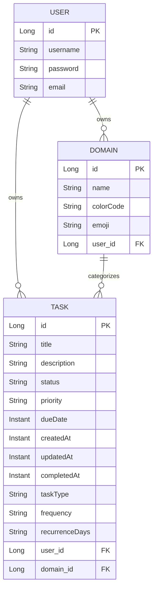
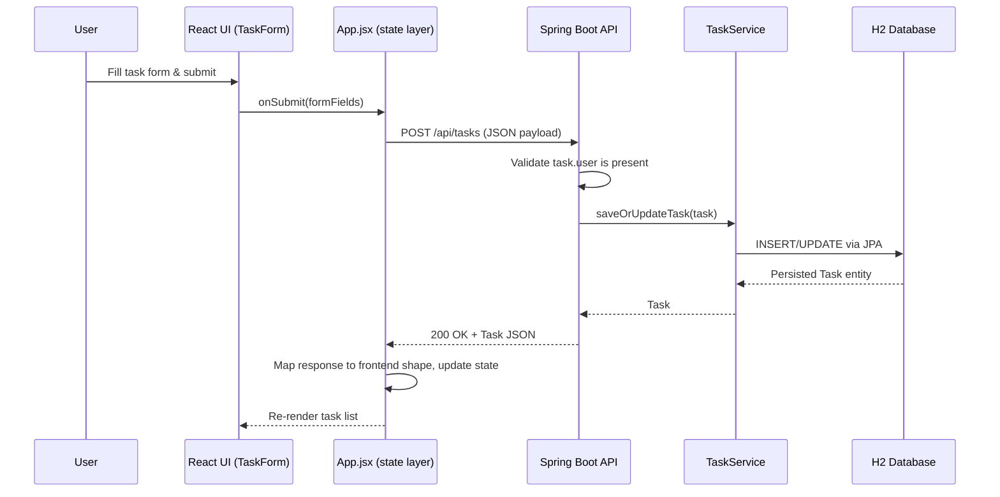

# TaskMaster 🎯

A full-stack task and habit management app with a **React 19 + Tailwind CSS 4** frontend and a **Java 21 / Spring Boot 4** REST API backend. TaskMaster organizes work into color-coded **Domains** (workspaces like "Academics" or "Personal") and supports both **one-time tasks** and **recurring routines** (daily, weekly, or custom weekday schedules), surfaced through a "Today's Focus" view that automatically computes what's due right now.

---

## Table of Contents

- [Features](#features)
- [Tech Stack](#tech-stack)
- [Architecture](#architecture)
- [Data Model](#data-model)
- [Request Pipeline](#request-pipeline)
- [Project Structure](#project-structure)
- [Getting Started](#getting-started)
- [API Reference](#api-reference)
- [Roadmap](#roadmap)

---

## Features

- **Authentication** — username/email signup and login (session persisted in `localStorage`)
- **Domains (Workspaces)** — create custom color + emoji-tagged categories to group tasks (e.g. 🎓 Academics, 🏠 Personal)
- **Task Management** — full CRUD on tasks with title, description, status (`Pending` → `In Progress` → `Completed`), priority, and due date
- **Recurring Routines** — mark a task as `ONETIME` or `RECURRING` with `DAILY`, `WEEKLY`, or `CUSTOM` (specific weekday) frequency
- **Three-View Workspace**
  - 🎯 **Today's Focus** — tasks/routines due or scheduled for today
  - 📂 **All Tasks** — full backlog across every domain
  - 🔁 **Routines & Habits** — dedicated recurring-task tracking board
- **Filtering & Sorting** — filter by status, search by title, sort by due date, and scope everything by domain
- **Responsive UI** — collapsible sidebar drawer for mobile, glassmorphic empty states, Tailwind-driven design system

---

## Tech Stack

| Layer | Technology |
|---|---|
| Frontend | React 19, Vite 8, Tailwind CSS 4 |
| Backend | Java 21, Spring Boot 4 (Web MVC, Spring Data JPA) |
| Database | H2 in-memory database (with web console) |
| Build Tools | npm / Vite (frontend), Maven (backend) |
| Linting | ESLint 10 |

> **Note:** Passwords are currently stored and compared in plain text and the H2 database is in-memory (data resets on every backend restart). See [Roadmap](#roadmap).

---

## Architecture



---

## Data Model



---

## Request Pipeline

Example flow for creating a task from the UI:



---

## Project Structure

```
TaskManager/
├── backend/                          # Spring Boot REST API
│   ├── src/main/java/com/taskmanager/backend/
│   │   ├── controller/               # AuthController, TaskController, DomainController
│   │   ├── service/                  # TaskService, DomainService
│   │   ├── repository/               # Spring Data JPA repositories
│   │   ├── model/                    # User, Task, Domain entities
│   │   ├── dto/                      # LoginRequest, RegisterRequest
│   │   ├── config/                   # DataInitializer (seeds demo data)
│   │   └── BackendApplication.java   # Spring Boot entry point
│   ├── src/main/resources/
│   │   └── application.properties    # H2 datasource + console config
│   └── pom.xml
│
├── src/                               # React frontend
│   ├── components/
│   │   ├── Login.jsx / Signup.jsx     # Auth screens
│   │   ├── Sidebar.jsx                # Domain navigation & creation
│   │   ├── TaskForm.jsx               # Create/Edit task modal
│   │   ├── FilterControls.jsx         # Search, status filter, sort
│   │   ├── TaskList.jsx / TaskItem.jsx
│   ├── App.jsx                        # App shell, state orchestration, API calls
│   └── main.jsx                       # React entry point
├── public/
├── index.html
├── vite.config.js
└── package.json
```

---

## Getting Started

### Prerequisites

- **Node.js** 18+ and npm
- **Java** 21 (JDK)
- Maven (or use the bundled `mvnw` / `mvnw.cmd` wrapper)

### 1. Run the backend (Spring Boot API)

```bash
cd backend
./mvnw spring-boot:run
```

The API starts on **`http://localhost:8080`**. On startup, `DataInitializer` seeds a demo user, two domains, and a few sample tasks so the app is immediately usable.

- H2 console: `http://localhost:8080/h2-console` → JDBC URL: `jdbc:h2:mem:taskmasterdb`, user: `sa`, no password

### 2. Run the frontend (React SPA)

```bash
npm install
npm run dev
```

The app starts on **`http://localhost:5173`** (Vite default) and talks to the backend at `http://localhost:8080/api`.

### 3. Log in

Use the seeded demo account, or sign up a new one:

```
username: aadhi
password: aadhi123
```

### Other useful scripts

```bash
npm run build     # Production build → dist/
npm run preview   # Preview the production build locally
npm run lint      # Run ESLint
```

---

## API Reference

Base URL: `http://localhost:8080/api`

### Auth

| Method | Endpoint | Description |
|---|---|---|
| POST | `/auth/signup` | Register a new user |
| POST | `/auth/login` | Log in with username + password |

### Tasks

| Method | Endpoint | Description |
|---|---|---|
| GET | `/tasks` | Get all tasks |
| GET | `/tasks/user/{userId}` | Get all tasks for a specific user |
| GET | `/tasks/{id}` | Get a single task by ID |
| POST | `/tasks` | Create a new task |
| PUT | `/tasks/{id}` | Update an existing task |
| DELETE | `/tasks/{id}` | Delete a task |

### Domains

| Method | Endpoint | Description |
|---|---|---|
| GET | `/domains` | Get all domains |
| GET | `/domains/user/{userId}` | Get all domains for a specific user |
| POST | `/domains` | Create a new domain |
| DELETE | `/domains/{id}` | Delete a domain |

---

## Roadmap

- [ ] Hash passwords (BCrypt) instead of storing/comparing plain text
- [ ] Replace localStorage-based session with proper token-based auth (JWT)
- [ ] Swap H2 in-memory DB for a persistent database (PostgreSQL/MySQL) for production
- [ ] Add automated recurring-task generation (auto-spawn instances per schedule)
- [ ] Write backend unit/integration tests and frontend component tests
